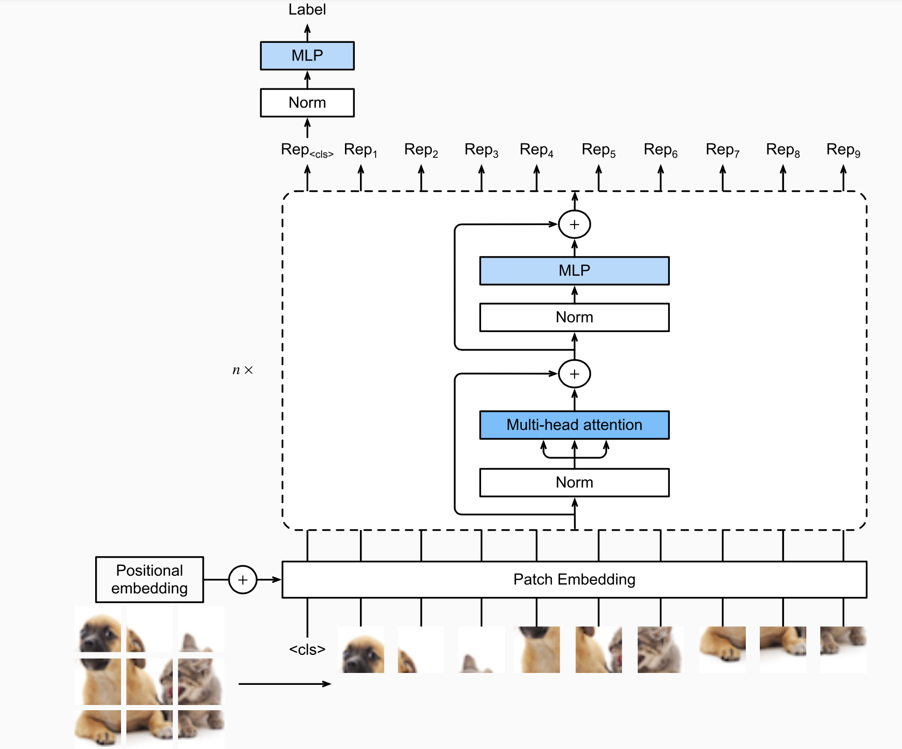

# Vision Transformer 

This repository implements a simple clissifer based on Vision Transformer 

This uses the d2l library with PyTorch. 

## Model

Classic Transformer architecture as follow : 
* Patch embedding (with convolution) + Positionnal embedding (learnable) 
* Normalization 1 
* Multihead Attention Layer 
* Residual Connection 
* Normalization 2 
* Multilayer processing with : 
    * Dense Layer 
    * GELU activation function (https://medium.com/@shauryagoel/gelu-gaussian-error-linear-unit-4ec59fb2e47c)
    * Dropout 
    * Dense Layer 
    * Dropout 
* Head with : 
    * Normalization
    * Linear Layer 

## Data 
We use MNIST Fashion dataset downloaded with d2l library 

